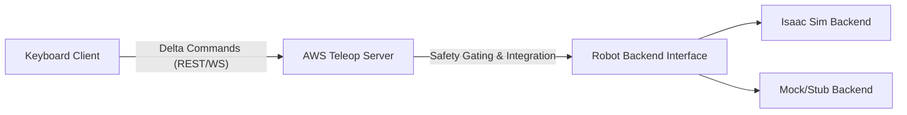

# Cloud-Native Robot Teleoperation System

## Description

A modular teleoperation system designed for low-latency end-effector control. It decouples client input from robot hardware/simulation via a safety-aware middleware server, deployed on AWS G5 instances.

## System Architecture



### Key Abstractions

- **Command Integrator**: Converts relative user input (Δx) into absolute workspace coordinates.
- **Backend Interface**: An abstract base class that allows hot-swapping between the high-fidelity Isaac Sim and a lightweight mock for unit testing.
- **Safety Monitor**: A middleware layer that enforces workspace bounds and velocity limits before commands reach the hardware.

## Robotics Fundamentals

### Coordinate Frames
Commands are processed in the World Frame.

### Safety
- **Deadman Switch**: Server-side timeout to ensure safety.
- **Workspace Clamping**: Prevents the robot from hitting the floor or self-colliding.

### Control
Uses Differential IK or a simple Pose-to-Pose controller within Isaac Sim.

## Deployment Instructions (AWS)

### Prerequisites
- AWS Account with g5.2xlarge or g4dn.xlarge limit increase.
- NVIDIA Driver & Docker installed (or use the provided `ec2_setup.sh`).

### Steps
1. **Launch Instance**: Use the "NVIDIA Omniverse" AMI.
2. **Clone & Build**:
   ```bash
   git clone <your-repo>
   docker-compose up --build
   ```
3. **Run Isaac Sim**: (Provide the specific command or script path).
4. **Connect Client**:
   ```bash
   python3 client/keyboard_client.py --ip <EC2_PUBLIC_IP>
   ```

## Design Notes & Tradeoffs

- **Why Delta Control?** Chosen to prevent the robot from 'teleporting' if a high-latency absolute command arrived late.
- **Why FastAPI/WebSockets?** Offers a balance between development speed and the low overhead required for 30Hz control loops.
- **Handling Ambiguity**: Standardized the backend to a 6-DOF UR10, but the `RobotBackend` class allows easy migration to any Franka or KUKA model.

## Future Improvements

- **Latency**: Implement Jitter Buffering or Client-Side Prediction.
- **Security**: Add JWT authentication for the Control API.
- **Production**: Move from EC2 to AWS RoboMaker for managed simulation scaling.